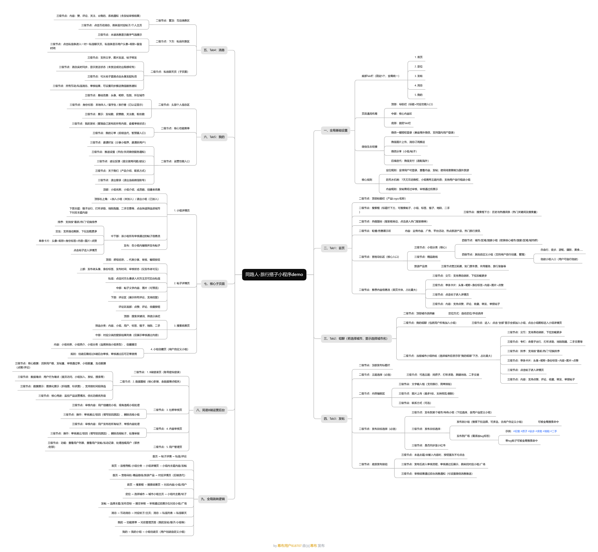
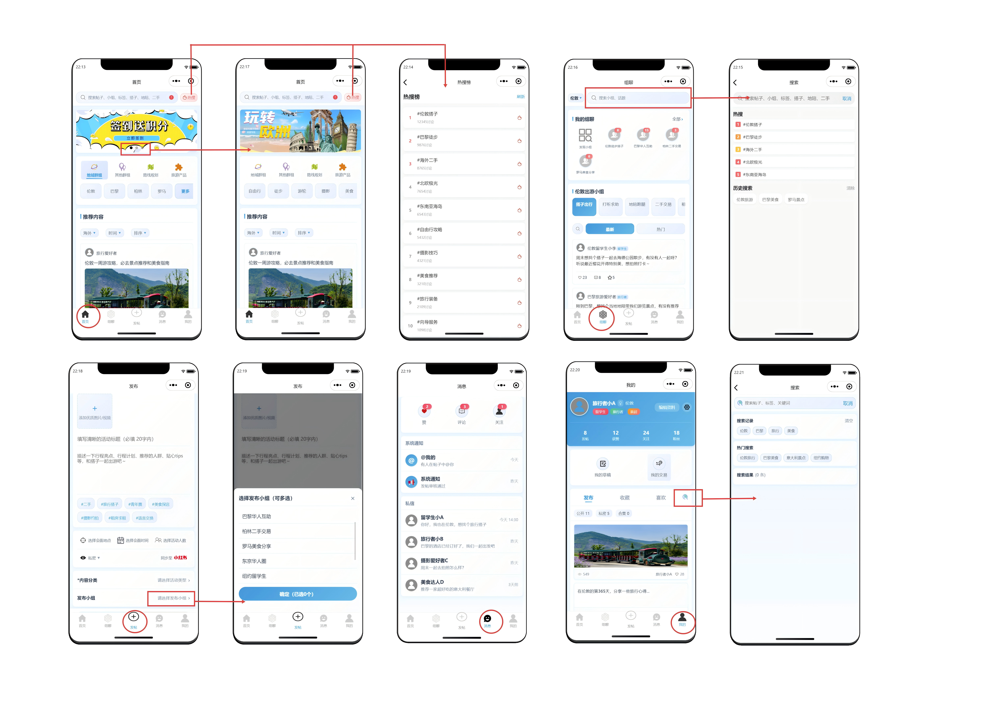

# 海外旅行搭子“同路人”微信小程序产品设计

# 文档概述

## 文档信息

|项目|内容|
|---|---|
|文档名称|海外旅行搭子微信小程序“同路人”（Demo版）PRD|
|文档版本 |V1\.0（Demo专属版）|
|适用阶段 |Demo开发、测试、上线验证|
|核心边界   |仅海外欧美场景、双核心用户、微信生态闭环、防社群死水、轻量化搭子\+担保交易|

## 文档目的

明确Demo版产品核心功能、用户需求、业务规则、落地标准，为开发、测试、验收提供唯一依据，快速验证海外社群融入→搭子匹配→轻量化交易核心闭环，规避社群死水问题。

## 文档范围

覆盖微信小程序端（仅移动端）、双核心用户（海外华人/留学生、海外旅行者）、核心功能模块、海外专属规则，不含后台复杂管理系统、全品类交易、跨区域联动。

## 文档受众

产品经理、开发工程师、测试工程师、UI设计师、运营人员

# 核心需求分析

## 核心定位

微信生态原生\+海外旅行搭子与轻交易平台。以海外旅行者快速融入当地社群为入口，以本地华人/留学生创收为初始核心驱动力，支持海外solo/小团体旅行场景下免费拼搭子 \+ 付费租搭子 \+ 旅行轻交易，轻量化担保，打造海外旅行社交\+服务闭环。

## 核心用户

1. 供给端

- 核心供给：海外华人/留学生（本地常驻，提供搭子服务、社群内容、本地资讯）

- 泛供给：本地居民、长期旅居者、其他旅行者、游客

2. 需求端

- 核心需求：海外旅行者（短期到访欧美，寻求搭子匹配、本地融入、旅行服务）

- 泛需求：本地居民、留学生、短期访客

## 业务边界

1. 支持范围：仅欧美国家/城市、仅旅行相关搭子/服务、微信生态内全流程

2. 禁止范围：国内场景、非旅行品类交易、复杂清结算、海外合规外功能

## 核心目标

1. 解决海外社群死水问题（内容\+匹配\+交易强绑定）

2. 验证双用户搭子匹配核心需求

3. 实现轻量化担保交易Demo闭环

4. 完成微信生态全打通，零门槛使用

# 用户需求\&痛点拆解

## 双用户需求分层（核心/次要/潜在）

### 供给端：海外华人/留学生

|需求层级|需求内容|
|---|---|
|核心需求 |1\. 发布服务/出租自己/物品置换 → 多渠道增收 2\. 接单快速、便捷、低门槛 3\. 社群活跃度 → 持续有游客需求 → 增强平台粘性 4\. 交易安全、担保可靠|
|次要需求|1\. 筛选优质游客，避免无效沟通；2\. 简单管理订单、消息、评价；|
|潜在需求|1\. 打造本地向导IP，长期稳定接单 ​2\. 拓展接送、陪玩、拍照、代购代提等轻服务，发展个人事业 3\. 跨城市华人资源联动，社交交友|

### 需求端：旅行者/游客/本地居民（泛需求）

|核心需求|1\. 快速找到靠谱本地人/留学生陪游服务 2\. 免费轻量化即时拼搭子、结伴同行 3\. 物品交换/易物（游客↔游客、游客↔本地） 4\. 轻量化担保交易，海外不怕被骗 5\. 融入当地社群，获取真实信息|
|---|---|
|次要需求 |1\. 中文界面、无时差障碍 2\. 可评价、可举报、可维权 3\. 行程简单协同|
|潜在需求|1\. 长期旅行搭子预约 2\. 海外应急帮助|

 

 

## 用户故事地图与痛点拆解

- **优先级定义**：P0=Demo 必做（核心闭环）、P1=Demo 可选（体验优化）、P2 = 后续迭代（非核心）

### 海外旅行者（需求侧）

### 海外华人 / 留学生（供给侧）

# 竞品对标与深度分析

## 竞品分类与核心对标对象

## 三类竞品维度分析

## 同路人差异化定位

# 功能架构设计

## 产品功能结构图

## 功能关联流程图

## 高保真交互逻辑图

